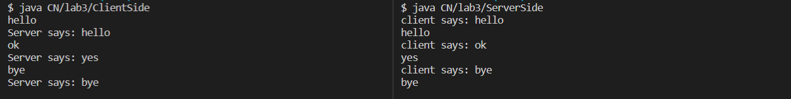

## Lab 3 - [Client Server Messaging in java]

### Objective

- To create a client server network for message sharing in Java

### Theory

- Client server network is a computer network type based on the client server architecture.
- It consists of a `Server` computer that controlls and manages all the resoures in the system and `Client` computers that are connected with each other via `Server computer`.

- **Steps to create a client-server network in java**
    1. Create a class to act as `server`
    2. Create another class to act as `client`
    3. In `server` class initiate a `Socket` by accepting a `ServerSocket` instance
    4. Create object for `DataInputStream`, `DataOutputStream` and `BufferedReader` then use the `readUTF()` method of `DataInputStream` to read message sent by client, use `readLine()` method of `BufferedReader` to read input of user and sent to server using `writeUTF()` method of `DataOutputStream`
    5. Finally close all the streams using `close()` method on some condition. (*in our case when serverw says bye*)
    6. In `client` class initiate a `Socket`
    7. Same as step 4 for client class
    8. Same as step 5 for client class
    9. Run the `server` code first then the `client` code
    10. Start messaging from `client` then `server` and continue alternatively till `bye in our case` 

### Source code

```java
/*Client side*/
import java.net.*;  
import java.io.*;  

public class ClientSide
{  
	public static void main(String args[])throws Exception
	{  
		Socket s=new Socket("localhost",3333);  
		
		DataInputStream din=new DataInputStream(s.getInputStream());  
		DataOutputStream dout=new DataOutputStream(s.getOutputStream());  
		BufferedReader br=new BufferedReader(new InputStreamReader(System.in));  
  
		String str="",str2="";  

		while(!str.equals("bye"))
		{  
			str=br.readLine();  
			dout.writeUTF(str);  
			dout.flush();  
			str2=din.readUTF();  
			System.out.println("Server says: "+str2);  
		}  
  
		dout.close();  
		s.close();  
	}
}
```

```java
/*Server side*/
import java.net.*;  
import java.io.*;  

public class ServerSide
{  
	public static void main(String args[])throws Exception
	{

		ServerSocket ss=new ServerSocket(3333);  
		Socket s = ss.accept();  
	
		DataInputStream din = new DataInputStream(s.getInputStream());  
		DataOutputStream dout = new DataOutputStream(s.getOutputStream());  
		BufferedReader br = new BufferedReader(new InputStreamReader(System.in));  
  
		String str="",str2="";  
	
		while(!str.equals("bye"))
		{  
			str = din.readUTF();  
			
			System.out.println("client says: "+str);  
			
			str2 = br.readLine();  
			
			dout.writeUTF(str2);  
			dout.flush();  
		}  
	
			din.close();  
			s.close();  
			ss.close();  
	}
}
```

### Output

