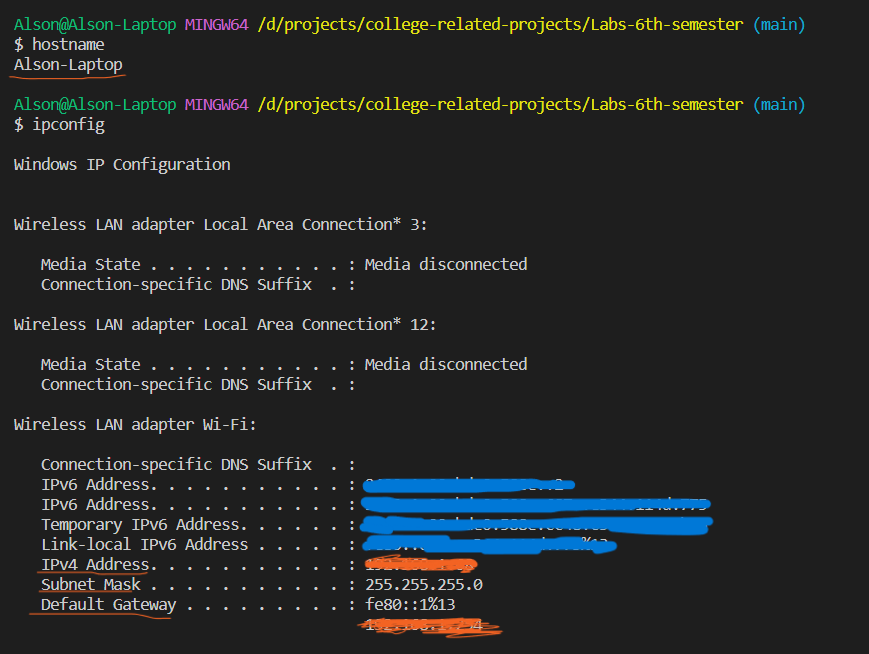
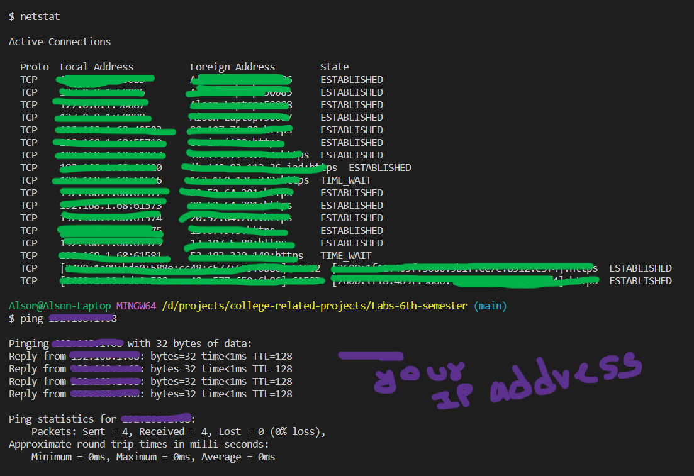

## Lab 4 - [Network commands]

### Objective

- To study about and use the following network commands
    1. ping
    2. netstat
    3. ipconfig
    4. hostname

### Theory

- **hostname command**: This command is used in networking to find out about the host of the network, in our cases the computer/laptop we are using.
- **netstat command**: This command is used in networking to find out every active TCP connections made by the host (our computer).
    - It consists of different options:
        - -a: Displays all connections and listening ports.
        - -e: Displays Ethernet statistics.
        - -i: Displays the time spent by a TCP connection in its current state.
        - -s: Displays per-protocol statistics.  By default, statistics are shown for IP, IPv6, ICMP, ICMPv6, TCP, TCPv6, UDP, and UDPv6;
- **ipconfig command**: This command is used in networking to find out about the ip address, Gateway address, subnet mask, etc about our computer in current network
- **ping command**: This is the primary TCP/IP command used to troubleshoot connectivity, reachability, and name resolution.

### Output

- hostname and ipconfig command

- netstat and ping command

