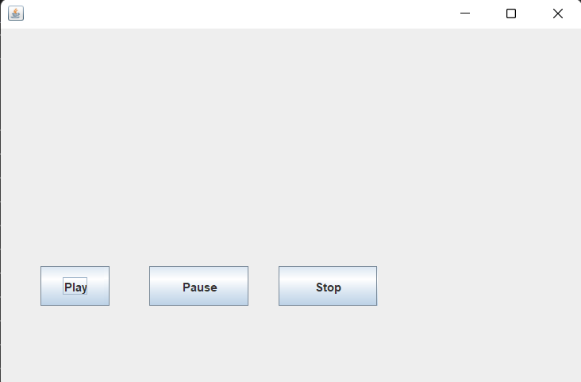

## Lab - 1 [Audio in Java]

### Objective

- To play , stop and resume audio in java

### Theory / Procedure

- To be able to play,stop and resume audio in java we need the following:
    1. A audio file (.m)
    2. `Swing` or `AWT`
- **Steps**
    1. Create a MusicPlayer class
    2. Create a `Clip` object to store audio clip
    3. Create a `long` to store the current timestamp of clip in microseconds
    4. Create `MusicPlayer Constructor` and create a `frame` and `buttons` to play, pause and stop functionality.
    5. Implement `ActionListener` and override the method `actionPerformed` to add action listener to the buttons.
    6. Add methods `playMusic()`, `pauseMusic()` and `stopMusic()`
    7. Use `File`, `AudioSystem` and `AudioInputStream` classes to get audio file from given path

### Source code

```java
import java.io.File;
import java.awt.event.*;

import javax.sound.sampled.AudioInputStream;
import javax.sound.sampled.AudioSystem;
import javax.sound.sampled.Clip;
import javax.swing.JButton;
import javax.swing.JFrame;

class MusicPlayer implements ActionListener {
    Clip clip;
    long clipTimePosition;
    JButton play, pause, stop;

    public MusicPlayer(String audioPath) {
        try {
            File musicPath = new File(audioPath);

            if(musicPath.exists()){
                JFrame frame = new JFrame();

                play = new JButton("Play");
                pause = new JButton("Pause");
                stop = new JButton("Stop");

                play.setBounds(40,240,70,40);
                pause.setBounds(150,240,100,40);
                stop.setBounds(280,240,100,40);

                frame.add(play);
                frame.add(pause);
                frame.add(stop);

                frame.setSize(600, 400);
                frame.setLayout(null);
                frame.setVisible(true);
                frame.setDefaultCloseOperation(JFrame.EXIT_ON_CLOSE);

                play.addActionListener(this);
                pause.addActionListener(this);
                stop.addActionListener(this);
             
                AudioInputStream audioInput = AudioSystem.getAudioInputStream(musicPath);

                clip = AudioSystem.getClip();
                clip.open(audioInput);
            }else{
                System.out.println("Can't find the file !!!");
            }
        } catch (Exception e) {
            e.printStackTrace();
        }
    }

    public void playMusic() {
        if(clip.getMicrosecondPosition()>=clip.getMicrosecondLength()||clip.getMicrosecondPosition()==0){
            clip.setMicrosecondPosition(0);
        }else{
            clip.setMicrosecondPosition(clipTimePosition);
        }
        clip.start();
    }

    public void pauseMusic() {
        clipTimePosition = clip.getMicrosecondPosition();
        clip.stop();
    }

    public void stopMusic() {
        clipTimePosition = 0;
        clip.stop();
    }

    @Override
    public void actionPerformed(ActionEvent e) {
        if(e.getSource()==play){
            playMusic();
        }
        if(e.getSource()==pause){
            pauseMusic();
        }
        if(e.getSource()==stop){
            stopMusic();
        }
    }
}

public class AudioDemo {
    public static void main(String[] args) {
        String path = "absolute-path/audio.wav";

        new MusicPlayer(path);
    }

    
}
```

### Conclusion

- Get audio file and play, pause, resume and stop the audio

### Output

