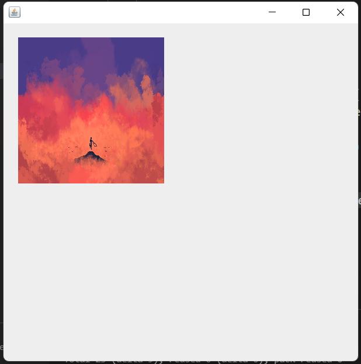

## Lab 2 - [Image in Java]

### Objective

- To load Image in Java application

### Theory / Procedure

- `AWT` and `Swing` are the GUI packages made by the java team inorder to create graphical interface uisng Java.
- `AWT` uses the OS underlying graphical interface to create the graphical shapes while `Swing` is totally independent as it is made totally in Java.

- The steps requried to load images are:
    1. Create a class that extends `Canvas`(a abstract class imported from awt to paint graphics)
    2. Override the `paint` method of Canvas class which takes a `Graphics` class object as parameter.
    3. Use the Graphics class object and use its method `drawImage` create image
    4. Finally create a `Frame` or `JFrame (Swing)` and add our class object as an component to the frame.

### Source Code

```java
/* Load image */
import java.awt.*;
import java.net.URL;
import javax.swing.JFrame;

public class ImageDemo extends Canvas {
    Image image = null;

    @Override
    public void paint(Graphics g) {
        super.paint(g);

        if(image == null){
            image = getImage("assets/test.jpg");
        }
        
        g.drawImage(image, 20, 20, 200, 200, this);
    }

    public Image getImage(String path) {
        Image tempImage = null;

        try {
            URL imageUrl = ImageDemo.class.getResource(path);
            tempImage = Toolkit.getDefaultToolkit().getImage(imageUrl);
        } catch (Exception e) {
            System.out.println("Error while getting image" + e.getMessage());
        }

        return tempImage;
    }

    public static void main(String[] args) {
        ImageDemo img = new ImageDemo();

        JFrame frame = new JFrame();

        frame.add(img);
        frame.setSize(500, 500);
        frame.setVisible(true);
    }
}
```

### Conclusion

- Loaded image in java

### Output

- Image load output



- Image Resize output

