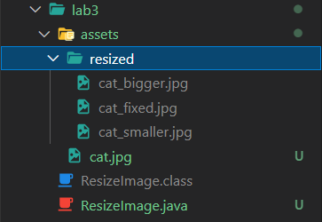

## Lab 3 - [Resize Image in Java]

### Objective

- To resize image in Java

### Theory / Procedure

- `AWT` and `Swing` are the GUI packages made by the java team inorder to create graphical interface uisng Java.
- `AWT` uses the OS underlying graphical interface to create the graphical shapes while `Swing` is totally independent as it is made totally in Java.

- The steps required to resize image are
    1. Use `File` class to get image from the path given
    2. Use the `ImageIO` class to read the image as `BufferedImage`
    3. Use the `BufferedImage` constructor to resize the image
    4. User the `ImageIO` class `write` method to produce a new image

### Source Code

```java
/*Resize image in Java*/
import java.awt.Graphics2D;
import java.awt.image.BufferedImage;
import java.io.File;
import java.io.IOException;

import javax.imageio.ImageIO;

public class ResizeImage {
    public static void resize(String inputImagePath,
            String outputImagePath, int scaledWidth, int scaledHeight)
            throws IOException {
        File inputFile = new File(inputImagePath);
        BufferedImage inputImage = ImageIO.read(inputFile);
 
        BufferedImage outputImage = new BufferedImage(scaledWidth,
                scaledHeight, inputImage.getType());
 
        Graphics2D g2d = outputImage.createGraphics();
        g2d.drawImage(inputImage, 0, 0, scaledWidth, scaledHeight, null);
        g2d.dispose();
 
        String formatName = outputImagePath.substring(outputImagePath
                .lastIndexOf(".") + 1);
 
        ImageIO.write(outputImage, formatName, new File(outputImagePath));
    }
    public static void resize(String inputImagePath,
            String outputImagePath, double percent) throws IOException {
        File inputFile = new File(inputImagePath);
        BufferedImage inputImage = ImageIO.read(inputFile);
        int scaledWidth = (int) (inputImage.getWidth() * percent);
        int scaledHeight = (int) (inputImage.getHeight() * percent);
        resize(inputImagePath, outputImagePath, scaledWidth, scaledHeight);
    }

    public static void main(String[] args) {
        String inputImagePath = "D:/projects/college-related-projects/Labs-6th-semester/Multimedia/lab2/assets/cat.jpg";
        String outputImagePath1 = "D:/projects/college-related-projects/Labs-6th-semester/Multimedia/lab2/assets/cat_fixed.jpg";
        String outputImagePath2 = "D:/projects/college-related-projects/Labs-6th-semester/Multimedia/lab2/assets/cat_smaller.jpg";
        String outputImagePath3 = "D:/projects/college-related-projects/Labs-6th-semester/Multimedia/lab2/assets/cat_bigger.jpg";
 
        try {
            int scaledWidth = 1024;
            int scaledHeight = 768;
            ResizeImage.resize(inputImagePath, outputImagePath1, scaledWidth, scaledHeight);
 
            double percent = 0.5;
            ResizeImage.resize(inputImagePath, outputImagePath2, percent);
 
            percent = 1.5;
            ResizeImage.resize(inputImagePath, outputImagePath3, percent);
 
        } catch (IOException ex) {
            System.out.println("Error resizing the image.");
            ex.printStackTrace();
        }
    }
 
}
```

### Conclusion

- Loaded image and resized it

### Output

- Image Resize output

