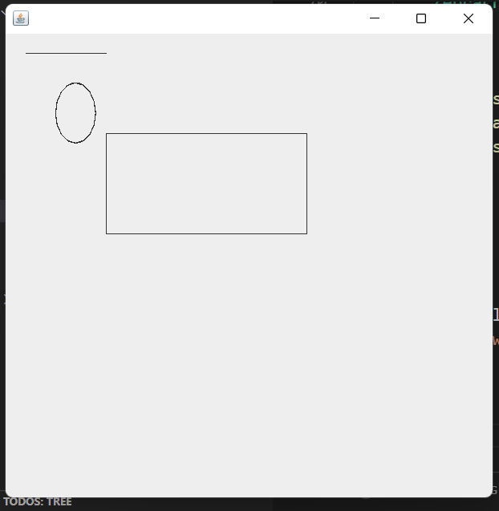
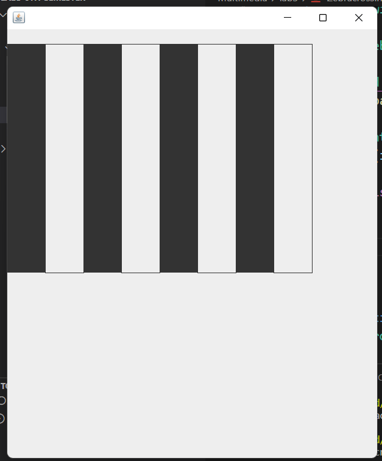

## Lab - 4 [Graphics in Java]

### Objective

- To create simple shapes such as rectangle, oval and line in java
- To create a zebra crossing graphics in java

### Theory / Procedure

- `AWT` and `Swing` are the GUI packages made by the java team inorder to create graphical interface uisng Java.
- `AWT` uses the OS underlying graphical interface to create the graphical shapes while `Swing` is totally independent as it is made totally in Java.

- The steps requried to create simple shapes are:
    1. Create a class that extends `Canvas`(a abstract class imported from awt to paint graphics)
    2. Override the `paint` method of Canvas class which takes a `Graphics` class object as parameter.
    3. Use the Graphics class object and use its different methods like `drawLine`, `drawOval`, etc to create graphics
    4. Finally create a `Frame` or `JFrame (Swing)` and add our class object as an component to the frame.
- The steps required to creating a Zebra crossing are as same as simple shapes instead of randomly drawing graphics we use the `drawRect` to draw a bordered rectangle and `fillRect` to draw a filled rectangle alternetively to create a zebra crossing.

### Source Code

```java
/* Simple shapes */
import javax.swing.JFrame;
import java.awt.*;

public class GraphicsDemo extends Canvas {
    
    @Override
    public void paint(Graphics g) {
        super.paint(g);

        g.drawRect(100, 100, 200, 100);
        g.drawLine(20, 20, 100, 20);
        g.drawOval(50, 50, 40, 60);
    }

    public static void main(String[] args) {
        GraphicsDemo gd = new GraphicsDemo();    
    
        JFrame frame = new JFrame();

        frame.setSize(500, 500);
        frame.add(gd);
        frame.setVisible(true);
    }
}
```

```java
/*Zebra Crossing in Java*/
import java.awt.*;
import javax.swing.JFrame;

public class Zebracrossing extends Canvas {
    @Override
    public void paint(Graphics g) {
        super.paint(g);

        for (int i = 0; i < 8; i++) {
            if(i%2==0){
                g.fillRect(i*50, 20, 50, 300);
            }else{
                g.drawRect(i*50, 20, 50, 300);
            }
        }
    }

    public static void main(String[] args) {
        Zebracrossing zc = new Zebracrossing();

        JFrame frame = new JFrame();

        frame.setSize(500, 600);
        frame.add(zc);
        frame.setVisible(true);
    }
}
```

### Conclusion

- Created simple shapes like oval, rectangle, line and a zebra crossing like graphics using `AWT - Canvas` and `Swing - JFrame`

### Output

- Simple shapes output



- Zebra crossing output

