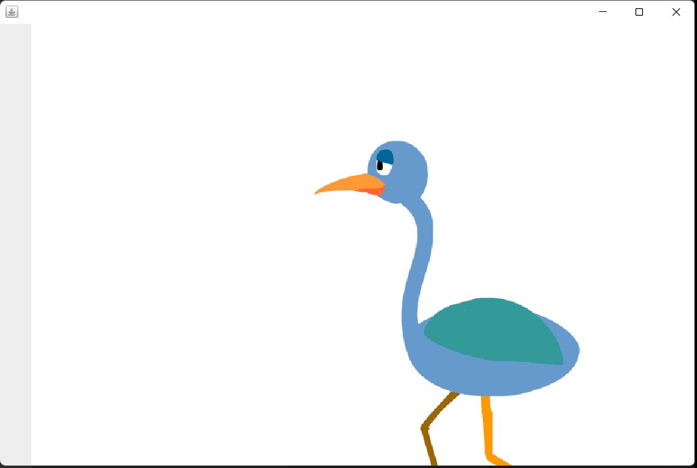

## Lab - 5 [Image Animation in Java]

### Objective

- To create an animation with image in Java

### Theory / Procedure

- `AWT` and `Swing` are the GUI packages made by the java team inorder to create graphical interface uisng Java.
- `AWT` uses the OS underlying graphical interface to create the graphical shapes while `Swing` is totally independent as it is made totally in Java.

- The steps requried to create simple shapes are:
    1. Create a class and extend `JPanel` and implement `ActionListener`
    2. Create a method to load image using the `URL` and `Toolkit` classes
    3. Override the `actionPerformed()` method to `repaint` the graphics/image
    4. Use the `paintComponent()` method to paint the image each time with different `x position` using a global `xPos` value
    5. Use the `Timer` class to create a animator and start the animaition

### Source Code

```java
import javax.swing.*;
import java.awt.*;
import java.awt.event.*;
import java.net.URL;

public class ImageAnimationDemo extends JPanel implements ActionListener {

    private Timer animator;
    private Image image;
    private int delay = 500, xPos = 0;

    public ImageAnimationDemo() {
        image = getImage("./assets/frame21.gif"); 
        animator = new Timer(delay, this);
        animator.start();
    }

    public void paintComponent(Graphics g) {
        super.paintComponent(g);

        if(xPos > 500){
            xPos = 0;
        }

        g.drawImage(image, xPos, 0, this);
        xPos += 20;
    }

    @Override
    public void actionPerformed(ActionEvent e) {
        repaint();
    }

    public Image getImage(String path) {
        Image tempImage = null;

        try {
            URL imageUrl = ImageAnimationDemo.class.getResource(path);
            tempImage = Toolkit.getDefaultToolkit().getImage(imageUrl);
        } catch (Exception e) {
            System.out.println("Error while getting image" + e.getMessage());
        }

        return tempImage;
    }
    
    public static void main(String[] args) {
        JFrame frame = new JFrame();
        ImageAnimationDemo imd = new ImageAnimationDemo();

        frame.add(imd);
        frame.setSize(900, 600);
        frame.setVisible(true);
        frame.setDefaultCloseOperation(JFrame.EXIT_ON_CLOSE);
    }
}
```

### Conclusion

- Created an animation with image in java

### Output


