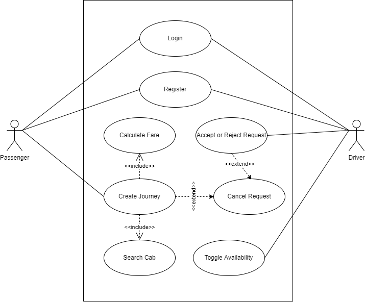
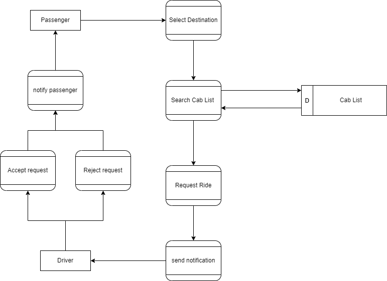
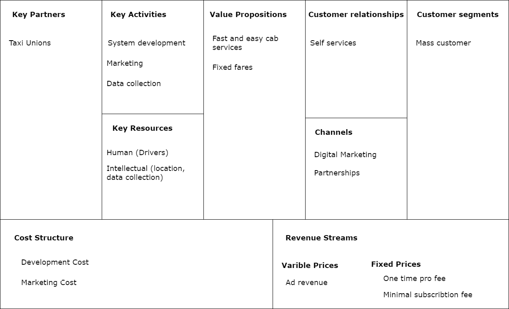
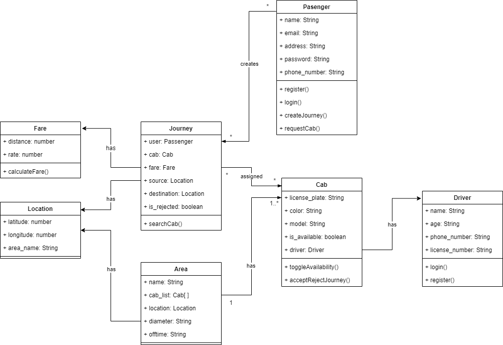
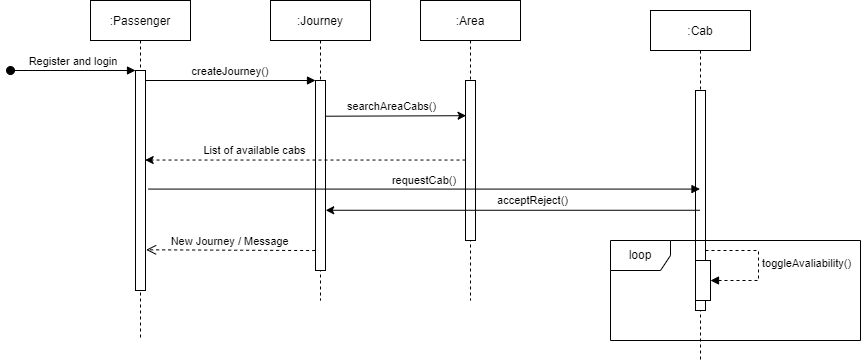

## Lab 1

- Creating `use case`, `level 2 dfd`, `business modal`, `class diagrams` and `system sequence diagram` of a project.

- USE CASE

- DFD

- BUSINESS MODAL

- CLASS DIAGRAM

- SYSTEM SEQUENCE DIAGRAM

